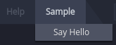
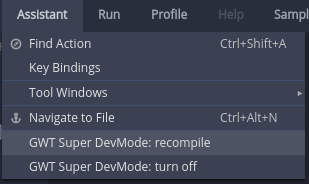

# Che IDE plugins getting started guide
This walkthrough helps you to get started with the basics of the Che IDE plugins.
- [Generate a Che plugin](#generate-a-che-plugin)
  * [pom.xml (key points)](#pomxml-key-points)
  * [IDE extension class](#ide-extension-class)
  * [Dependency injection](#dependency-injection)
- [Build and run](#build-and-run)
- [Development and debugging](#development-and-debugging)
- [Add your plugin to IDE assembly](#add-your-plugin-to-ide-assembly)

## Generate a Che plugin
There're [several Maven archetypes](https://github.com/eclipse/che-archetypes/blob/master/README.md#archetype-list) for generating a new Che IDE plugin.
Execute the following command to generate an IDE plugin that adds a menu item that pops up a notification:
```
mvn archetype:generate \
   -DarchetypeGroupId=org.eclipse.che.archetype \
   -DarchetypeVersion=LATEST \
   -DarchetypeArtifactId=plugin-menu-archetype
```
During the code generation you will be asked to define the several properties:
- groupId - type `org.eclipse.che.plugin`
- artifactId - type `che-plugin-menu`
- version - just hit the <kbd>Enter</kbd> to use `1.0-SNAPSHOT`
- package - type `org.eclipse.che.plugin.menu`

Project with Che IDE plugin represents a Maven multi-module project with the following structure:
```
che-plugin-menu
├─ assembly                  // Basic Che with the generated plugin
│  ├─ assembly-ide-war
│  └─ assembly-main
└─ plugins
   └─ che-plugin-menu
      └─ che-plugin-menu-ide // IDE part of the plugin
```
> Basic Che doesn't include any plugins and intended to help you quickly [test your plugin](#testing-changes).

Let's look into the `che-plugin-menu-ide` Maven module structure:
```
ide
├─ src                                              // sources folder
│  └─ main
│     ├─ java
│     │  └─ org.eclipse.che.plugin.menu.ide
│     │     ├─ ...
│     │     ├─ inject
│     │     │  └─ SampleMenuGinModule.java          // GIN module
│     │     └─ SampleMenuExtension.java             // entry point
│     ├─ resources
│     │  └─ org.eclipse.che.ide.ext.demo.client
│     └─ module.gwt.xml                             // template for generating GWT module (for more details, see https://tbroyer.github.io/gwt-maven-plugin/generate-module-mojo.html)
├─ target                                           // build output
│  └─ classes
│     ├─ META-INF
│     │  └─ gwt
│     │     └─ mainModule                           // contains GWT module name (for more details, see https://tbroyer.github.io/gwt-maven-plugin/generate-module-metadata-mojo.html)
│     └─ org.eclipse.che.plugin.menu
│        ├─ ...
│        └─ SampleMenuExtension.gwt.xml             // generated GWT module (for more details, see https://tbroyer.github.io/gwt-maven-plugin/generate-module-mojo.html)
└─ pom.xml
```

### pom.xml (key points)
There are several important parts in the pom.xml of the Che IDE plugin - `che-plugin-menu/plugins/che-plugin-menu/che-plugin-menu-ide/pom.xml`.
- Packaging of the Maven project is `gwt-lib` which triggers [`gwt-lib`](https://tbroyer.github.io/gwt-maven-plugin/lifecycles.html#GWT_Library:_gwt-lib) Maven lifecycle that will build a [GWT library](https://tbroyer.github.io/gwt-maven-plugin/artifact-handlers.html#GWT_Library:_gwt-lib):
  ```xml
  <packaging>gwt-lib</packaging>
  ```
- Dependency on the Che IDE API library that provides a [set of APIs](https://docs.google.com/spreadsheets/d/1ijapDnl1G7svy7sIKgTntyTuVsnd9nFcH0-357C0MxE/edit#gid=0) for extending Che IDE:
  ```xml
  <dependency>
      <groupId>org.eclipse.che.core</groupId>
      <artifactId>che-core-ide-api</artifactId>
  </dependency>
  ```
- Name of the GWT module is defined in the configuration of `gwt-maven-plugin`:
  ```xml
  <plugin>
      <groupId>net.ltgt.gwt.maven</groupId>
      <artifactId>gwt-maven-plugin</artifactId>
      <extensions>true</extensions>
      <configuration>
          <moduleName>org.eclipse.che.plugin.menu.SampleMenuExtension</moduleName>
      </configuration>
  </plugin>
  ```
For details on the generating GWT module, read the `gwt:generate-module` [mojo description](https://tbroyer.github.io/gwt-maven-plugin/generate-module-mojo.html).

### IDE extension class
Che IDE plugin has an entry point - Java class annotated with an [`@org.eclipse.che.ide.api.extension.Extension`](https://github.com/eclipse/che/blob/master/ide/che-core-ide-api/src/main/java/org/eclipse/che/ide/api/extension/Extension.java) annotation. Plugin entry point is called immediately after initializing the core part of the Che IDE.

Here's an entry point of the plugin that we've generated:
```java
package org.eclipse.che.plugin.menu.ide;

import static org.eclipse.che.ide.api.action.IdeActions.GROUP_HELP;
import static org.eclipse.che.ide.api.action.IdeActions.GROUP_MAIN_MENU;
import static org.eclipse.che.ide.api.constraints.Anchor.AFTER;

import com.google.inject.Inject;
import org.eclipse.che.ide.api.action.ActionManager;
import org.eclipse.che.ide.api.action.DefaultActionGroup;
import org.eclipse.che.ide.api.constraints.Constraints;
import org.eclipse.che.ide.api.extension.Extension;
import org.eclipse.che.plugin.menu.ide.action.SampleAction;

@Extension(title = "Sample Menu")
public class SampleMenuExtension {

  private static final String SAMPLE_GROUP_MAIN_MENU = "Sample";

  @Inject
  private void prepareActions(SampleAction sampleAction, ActionManager actionManager) {

    DefaultActionGroup mainMenu = (DefaultActionGroup) actionManager.getAction(GROUP_MAIN_MENU);

    DefaultActionGroup sampleGroup =
        new DefaultActionGroup(SAMPLE_GROUP_MAIN_MENU, true, actionManager);
    actionManager.registerAction("sampleGroup", sampleGroup);
    mainMenu.add(sampleGroup, new Constraints(AFTER, GROUP_HELP));

    actionManager.registerAction("sayHello", sampleAction);
    sampleGroup.add(sampleAction, Constraints.FIRST);
  }
}
```

### Dependency injection
Che IDE use [Google GIN](https://code.google.com/archive/p/google-gin/) for dependency injection. Che IDE plugin can provide a GIN module. In order to be picked-up by IDE, plugin's GIN module should be annotated with an [`@org.eclipse.che.ide.api.extension.ExtensionGinModule`](https://github.com/eclipse/che/blob/master/ide/che-core-ide-api/src/main/java/org/eclipse/che/ide/api/extension/ExtensionGinModule.java) annotation.

Here's a GIN module of the plugin that we've generated:
```java
package org.eclipse.che.plugin.menu.ide.inject;

import com.google.gwt.inject.client.AbstractGinModule;
import org.eclipse.che.ide.api.extension.ExtensionGinModule;

@ExtensionGinModule
public class SampleMenuGinModule extends AbstractGinModule {

  @Override
  protected void configure() {}
}
```

## Build and run
There's Basic Che assembly generated in the `assembly` folder to help you quickly test your plugin. To try the plugin that is being developed follow the next steps:
1. Build the whole project with your plugin (`che-plugin-menu` folder): `mvn clean install`.
2. Start Basic Che with your plugin included:
```
docker run -it --rm -v /var/run/docker.sock:/var/run/docker.sock \
                    -v <local-path>:/data \
                    -v <local-assembly>:/assembly \
                    eclipse/che:nightly start
```
Here's an example:
```
docker run -it --rm -v /var/run/docker.sock:/var/run/docker.sock \
                    -v /home/user/che/data:/data \
                    -v /home/user/projects/che-plugin-menu/assembly/assembly-main/target/eclipse-che-1.0-SNAPSHOT/eclipse-che-1.0-SNAPSHOT:/assembly \
                    eclipse/che:nightly start
```
3. Open launched Che IDE and see that `Sample Menu` plugin is included:
- plugin name is in the plugins list `Profile -> Preferences`;
- menu `Sample` with action `Say Hello` is present in the menu bar.



## Development and debugging
GWT Super DevMode allows you to quickly recompile your code and see the results in a browser.

To load Che IDE in Super DevMode you need to launch GWT Code Server.
> GWT Code Server runs the GWT compiler in draft mode, with most optimizations turned off.

Go to the root folder of the Che plugin project (`che-plugin-menu`) and execute the command:

`mvn gwt:codeserver -pl :assembly-ide-war -am`

Once the CodeServer is run you'll see the message in a terminal:

`[INFO] The code server is ready at http://127.0.0.1:9876/`

Now you can recompile Che IDE with your changes by clicking `Assistant -> GWT Super DevMode: recompile` menu item.



You can debug Java code of your plugin using [Chrome DevTools](https://developers.google.com/web/tools/chrome-devtools/) when Che IDE is launched in a Super DevMode.

## Add your plugin to IDE assembly
To build Che IDE full assembly (with all plugins included) including your plugin:
1. Clone Che sources: `git clone git@github.com:eclipse/che.git`
2. Add a plugin dependency to `<dependencyManagement>` section in [che/pom.xml](https://github.com/eclipse/che/blob/master/pom.xml):
```xml
<dependency>
    <groupId>org.eclipse.che.plugin</groupId>
    <artifactId>plugin-menu-ide</artifactId>
    <version>1.0-SNAPSHOT</version>
</dependency>
```
3. Add a plugin dependency to [che/ide/che-ide-full/pom.xml](https://github.com/eclipse/che/blob/master/ide/che-ide-full/pom.xml):
```xml
<dependency>
    <groupId>org.eclipse.che.plugin</groupId>
    <artifactId>plugin-menu-ide</artifactId>
</dependency>
```
4. Build Che IDE: `mvn sortpom:sort && mvn clean install`
